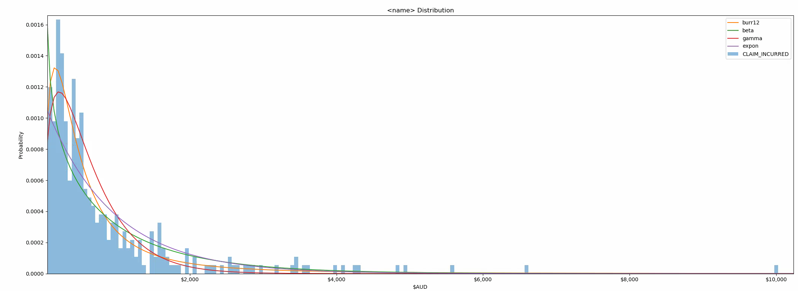

# Fitting Statistical Distribution
## Purpose
This module allowed you to fit various continuous distribution and compare amongst them.
A best probability density function (pdf) is chosen according to the input data,
by comparing the sum-of-square-error (SSE) made between the fitted pdf and the histogram generated by the data.<br>

### Table of Contents
    
* [Initialising](#initialising)
* [Functions](#functions)
    * [1. compare](#1-compare)
    * [2. make_pdf](#2-make_pdf)


## Initialising
Download the file `Distribution_Fitting.py` and placed it into the working directory.
To initialise the object, do the following:
```
import Distribution_Fitting as DS

cls_obj = DS.fit_distribution(<data>,<name>)

```
`<data>` - The input data series. <br>
`<name>` - The referencing name for the input data. <br>


## Functions:
This module contained **two** funnctions:<br>
1. `compare(dist_name)`<br>
2. `make_pdf(distribution,params)`<br>


### 1. compare
`compare(dist_name)` is the most common use fuction. 
The parameter `dist_name` takes a list of distributions' name. <br>

For example, to compare between **exponential** distribution and **gamma** distribution do the following:<br>
`best_fit_name, best_fit_params = cls_obj.compare(dist=['expon','gamma'])`<br>

A best fitted distribution and its corresponding parameter is returned.
A comparison graph will be generated in the process.
<p align="center">
  
</p>

Some common distribution used for **insurance claims cost** are as follows:<br>
```
dist_name=['expon',`gamma`,'beta','burr12',`pareto`,'weibull_min']
```
You may also try other continuous statistical distribution in `scipy` such as:
```
dist_name = [        
    'alpha','anglit','arcsine','beta','betaprime','bradford','burr','cauchy','chi','chi2','cosine',
    'dgamma','dweibull','erlang','expon','exponnorm','exponweib','exponpow','f','fatiguelife','fisk',
    'foldcauchy','foldnorm','frechet_r','frechet_l','genlogistic','genpareto','gennorm','genexpon',
    'genextreme','gausshyper','gamma','gengamma','genhalflogistic','gilbrat','gompertz','gumbel_r',
    'gumbel_l','halfcauchy','halflogistic','halfnorm','halfgennorm','hypsecant','invgamma','invgauss',
    'invweibull','johnsonsb','johnsonsu','ksone','kstwobign','laplace','levy','levy_l','levy_stable',
    'logistic','loggamma','loglaplace','lognorm','lomax','maxwell','mielke','nakagami','ncx2','ncf',
    'nct','norm','pareto','pearson3','powerlaw','powerlognorm','powernorm','rdist','reciprocal',
    'rayleigh','rice','recipinvgauss','semicircular','t','triang','truncexpon','truncnorm','tukeylambda',
    'uniform','vonmises','vonmises_line','wald','weibull_min','weibull_max','wrapcauchy'
]
```

### 2. make_pdf 
`make_pdf(dist, params)` is used to generate data point from the chosen pdf.
Parameter `dist` take a `scipy.stats` object, and `best_fit_params` is the parameter that corresponds to the respective distribution.

We can utilised the result returned from step 1 in the example below, such as `best_fit_name` and `best_fit_params`:

```
import scipy.stats as st
best_dist = getattr(st, best_fit_name)

#Generate data point for curve plotting
pdf = cls_obj.make_pdf(best_dist, best_fit_params)
```

`pdf` is a data series that can be plotted using matplotlib.


```
import matplotlib
import matplotlib.pyplot as plt
import numpy as np

plt.figure(figsize=(12,12))
ax = pdf.plot(lw=1, label='PDF', legend=True)
```


<details>
    <summary>other statistical properties</summary>
```
#find all moment
mean, var, skew, kurt=best_dist.stats(*best_fit_params,moments='mvsk')

#Put all parameter into a string
param_names = (best_dist.shapes + ', loc, scale').split(', ') if best_dist.shapes else ['loc', 'scale']
param_str = ', '.join(['{}={:0.2f}'.format(k,v) for k,v in zip(param_names, best_fit_params)])
dist_str = '{}({})'.format(best_fit_name, param_str)
```
</details>


<details>
    <summary>other graph setting</summary>
```
#plot histogram
cls_obj.data.plot(kind='hist', bins=250, density=True, alpha=0.5, label='Data', legend=True, ax=ax)
#draw line to represent mean
plt.axvline(mean,linestyle="--",color='r')

#chart title and axis title
ax.set_title('%s \n %s \n mean = %s' %(cls_obj.name, dist_str, np.round(mean,4) ))
ax.xaxis.set_major_formatter(matplotlib.ticker.StrMethodFormatter('${x:,.0f}'))
ax.set_xlabel('$AUD')
ax.set_ylabel('Probability')

#set y limit
dataYLim = ax.get_ylim()
ax.set_ylim(dataYLim)
plt.show()
```
</details>  


## 
<h6 align="center">
&copy; Quantuary 2020
</h6>    
    
